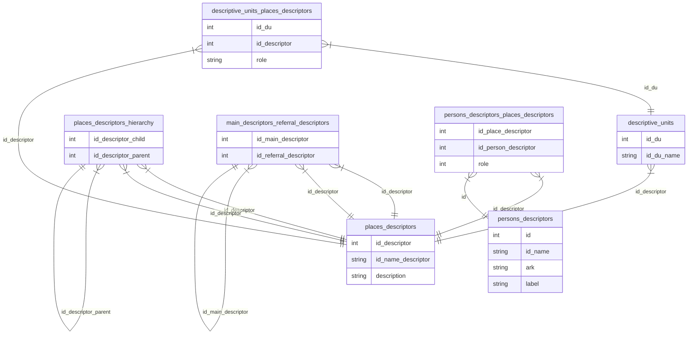

# Dataset
The [dataset](https://github.com/burgerbibliothek/glamhack26/tree/main/data/src/data) consists of five tables (in the [parquet](https://parquet.apache.org/docs/overview/) format):
- `places_descriptors` contains all available place descriptors.
- `persons_descriptors` contains all available person descriptors (legal entities and natural persons).
- `descriptive_units` contains descriptive units.
- `descriptive_units_places_descriptors` contains associations between place descriptors and descriptive units.
- `main_descriptors_referral_descriptors` contains the associations between main descriptors and referral descriptors.
- `persons_descriptors_places_descriptors` contains the associations between place descriptors and person descriptors.
- `places_descriptors_hierarchy` contains the hierarchy of place descriptors.


## Table `places_descriptors`
- The column `id_descriptor` contains the numeric ID for a place descriptor.
- The column `id_name_descriptor` contains another form of an ID for the place descriptor (e.g. “Bern (BE) (Orte\Sch\Schweiz (CH)\Bern (Kanton)”). In the last outermost pair of parentheses in the id name, the hierarchy can be traced. In the provided example, it's visible, that the place descriptor “Bern (BE)” is a child of the place descriptor “Bern (Kanton)”, which itself is the child of “Schweiz (CH)”, and so on.
- The column `description` contains a label and describes how the place descriptor is called (mostly with a German exonym).

## Table `descriptive_units`
- The column `id_du` contains the numeric ID for a descriptive unit.
- The column `id_du_name` contains another form of an ID for a descriptive unit.

## Table `persons_descriptors`
- The column `id` contains the numeric ID for the person descriptor.
- The column `id_name` contains another form of an ID for the person descriptor (e.g. “Bern (Burgergemeinde), Burgerbibliothek (Personen\Juristische Personen\B)”). The id name contains an indication if the descriptor is a legal entity or natural person.
- The column `ark` contains another form of an ID for a descriptive unit.
- The column `label` contains another form of an ID for a descriptive unit.

## Table `descriptive_units_places_descriptors`
- The column `id_du` contains the numeric ID for a descriptive unit.
- The column `id_descriptor` contains the numeric ID for a place descriptor.
- The column `role` contains further description for the relation.

## Table `persons_descriptors_places_descriptors`
- The column `id_place_descriptor` contains the numeric ID for place descriptor.
- The column `id_person_descriptor` contains the numeric ID for a person descriptor.
- The column `role` contains further description for the relation (1 = place of birth, 2 = place of death , 3 = place of activity, 4 = place of origin, 5 = place of residence).

## Table `main_descriptors_referral_descriptors`
This table contains the associations between main descriptors and referral descriptors. Referral descriptors, always point to a main descriptor (e.g. "Arabergass" → "Arabergasse") and are not associated with a descriptive unit.
- The column `id_main_descriptor` contains the ID of a main descriptor.
- The column `id_referral_descriptor` contains the ID of a referral descriptor.

## Table `places_descriptors_hierarchy`
This table contains pairs of place descriptor ids in order to reconstruct their hierarchy (e.g. “Bern (BE)” is a child of the place descriptor “Bern (Kanton)”.
- The column `id_descriptor_child` contains the id of a place descriptor.
- The column `id_descriptor_parent` contains the id of a place descriptor.

## Specialties in the dataset
The children of the descriptor (Orte\Sch\Schweiz (CH)\Bern (Kanton)\Bern (BE)\Historisch-Topographisches Lexikon\) are a special kind of place descriptor. They represent lexicon entries from the “[Historisch-topographische Lexikon der Stadt Bern von Berchtold Weber](https://archives-quickaccess.ch/search/bbb/lexikon)”. They do contain some additional data about a place (e.g. [ark:36599/nw00xr4nws1](https://ark.burgerbib.ch/ark:36599/nw00xr4nws1)). The Hist.-topo data has been incorporated in the [bernese city map](https://map.bern.ch/stadtplan/?grundplan=Stadtplan_farbig_Geoportal|Stadtplan_farbig_Extern_Region&koor=2600471,1199698&zoom=3&hl=0&layer=Strassennamen), which is the reason why the entries possess a persistent identifier (ARK). For simplicity, the ARK and additional Hist.-topo. data is not included in the above tables.

# Queries
## Get all descriptors concerning the “Historisch-Topographisches Lexikon”
```SQL
# Table places_descriptors
SELECT id_descriptor, id_name_descriptor, regexp_matches(id_name_descriptor, '\(Orte\\Sch\\Schweiz \(CH\)\\Bern \(Kanton\)\\Bern \(BE\)\\Historisch-Topographisches Lexikon\\[A-Z]\)') AS find
FROM file
WHERE find = true
```

# Tools
- [ParquetViewer](https://parquetviewer.app/) is a viewer for parquet files, which runs directly in your browser.
- [Pixi](https://pixi.prefix.dev) is reproducible package management tool for developers.

