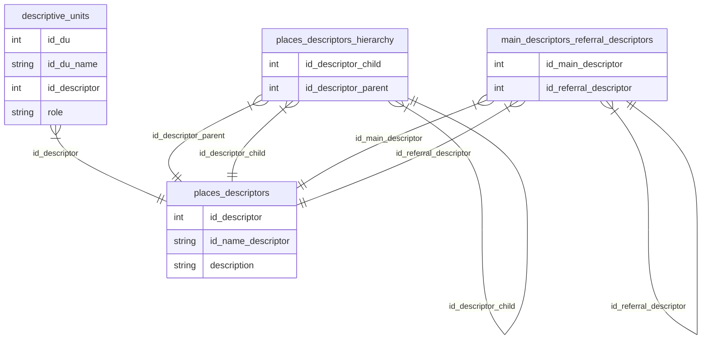

# Dataset
The dataset consists of three tables:
- `places_descriptors` contains all available place descriptors.
- `descriptive_units` contains descriptive units and associations to place descriptors.
- `main_descriptors_referral_descriptors` contains the relations between main descriptors and referral descriptors.
- `places_descriptors_hierarchy` contains the hierarchy of place descriptors.

## Table `places_descriptors`
- The column `id_descriptor` contains the numeric ID for a place descriptor.
- The column `id_name_descriptor` contains another form of an ID for the place descriptor (e.g. “Bern (BE) (Orte\Sch\Schweiz (CH)\Bern (Kanton)”). In the last outermost pair of parentheses in the id name, the hierarchy can be traced. In the provided example, it's visible, that the place descriptor “Bern (BE)” is a child of the place descriptor “Bern (Kanton)”, which itself is the child of “Schweiz (CH)”, and so on.
- The column `description` contains a label and describes how the place descriptor is called (mostly with a German exonym).

## Table `descriptive_units`
- The column The column `id_du` contains the numeric ID for a descriptive unit.
- The column `id_du_name` contains another form of an ID for a descriptive unit.
- The column `id_descriptor` contains ...
- The column `role` contains ...

## Table `main_descriptors_referral_descriptors`
This table contains the relations between main descriptors and referral descriptors. Referral descriptors, always point to a main descriptor (e.g. "Arabergass" → "Arabergasse")
- The column `id_main_descriptor` contains the ID of a main descriptor.
- The column `id_referral_descriptor` contains the ID of a referral descriptor.

## Table `places_descriptors_hierarchy`
This table contains pairs of place descriptor ids in order to reconstruct their hierarchy (e.g. “Bern (BE)” is a child of the place descriptor “Bern (Kanton)”.
- The column `id_descriptor_child` contains the id of a place descriptor.
- The column `id_descriptor_parent` contains the id of a place descriptor.

# Tools
- [ParquetViewer](https://parquetviewer.app/) is a viewer for parquet files, which runs directly in your browser.
- [Pixi](https://pixi.prefix.dev) is reproducible package management tool for developers.

