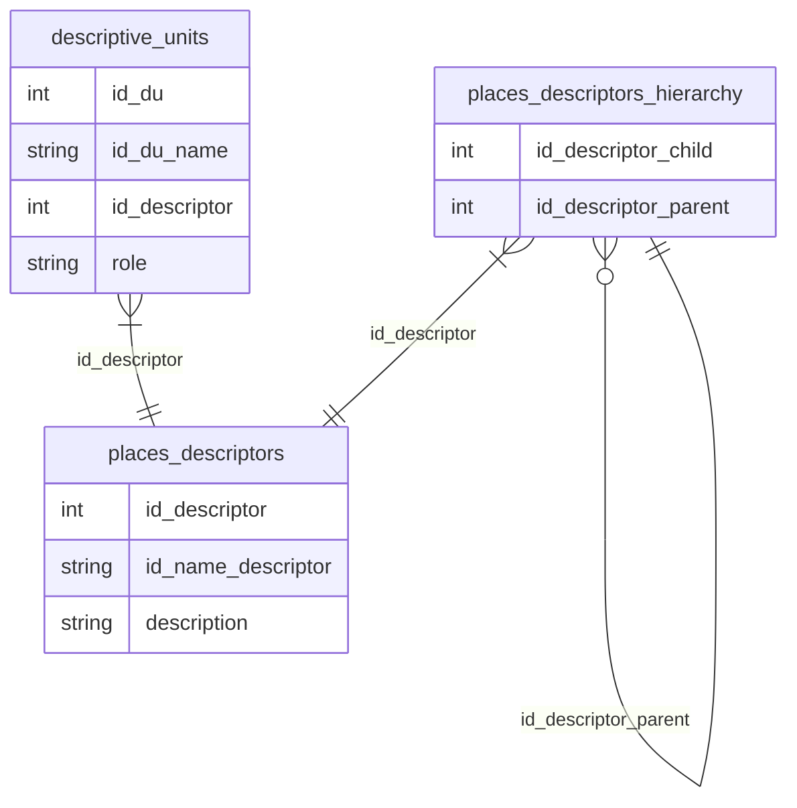

# Data Model

```mermaid
erDiagram
    descriptive_units }|--|| places_descriptors : id_descriptor
    places_descriptors_hierarchy }|--|| places_descriptors : id_descriptor
    places_descriptors_hierarchy }o--|| places_descriptors_hierarchy : id_descriptor_parent
    descriptive_units {
        int id_du
        string id_du_name
        int id_descriptor
        string role
    }
    places_descriptors {
        int id_descriptor
        string id_name_descriptor
        string description
    }
    places_descriptors_hierarchy{
        int id_descriptor_child
        int id_descriptor_parent
    }
```